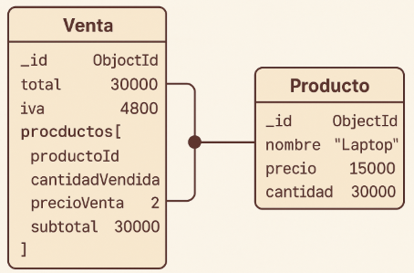

# Sistema de Ventas con Mongoose

Sistema de gestión de ventas e inventario desarrollado con Node.js, MongoDB y Mongoose. Implementa el patrón DAO (Data Access Object) para manejar operaciones CRUD completas sobre productos y ventas, con control automático de inventario.

## Diagrama de Modelos



El sistema relaciona ventas con productos mediante referencias de ObjectId, permitiendo un control completo del inventario y trazabilidad de las ventas.

### Para ejecutar el proyecto:
1. Clona el repositorio.
2. Instala las dependencias con `npm install`.
3. Configura la conexión a MongoDB en `config.js`.
4. Ejecuta los ejemplos con `node ejemplos-uso.js`.

### Se recomienda usar el archivo docker-compose.yml para levantar un contenedor de mongo y mongo-express para gestionar la base de datos.
```docker-compose up -d --build```
